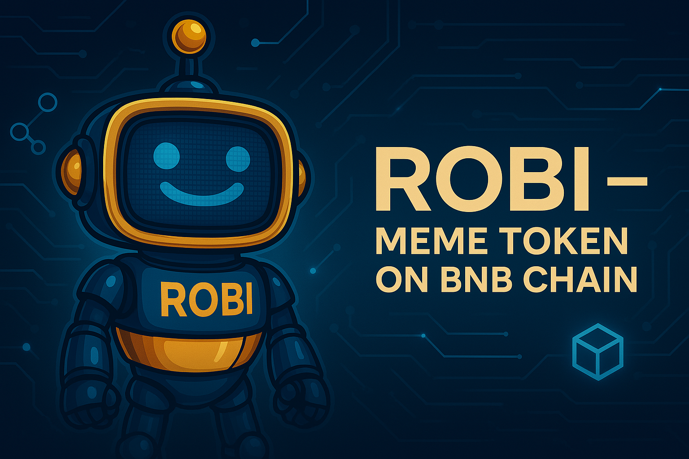

  

# ROBI — Meme Token on BNB Chain

ROBI is a meme token built on the BNB Chain. It has no financial value and is designed for fun, culture, and community experimentation in Web3.

## Mission & Purpose

The goal of ROBI is to unite people around decentralization, creativity, and open participation. It’s a community token — not a utility or investment — created to empower engagement through memes, social movements, and shared values.

## Token Information

- Name: ROBI  
- Symbol: $ROBI  
- Chain: BNB Chain (BEP-20)  
- Launch Date: April 7, 2025  
- Contract: [Insert contract address]

## Tokenomics

| Allocation            | Percentage | Notes                             |
|-----------------------|------------|------------------------------------|
| Community & Airdrops  | 70%        | Meme campaigns, giveaways, events |
| Marketing             | 15%        | Awareness & growth efforts         |
| Team (Locked)         | 10%        | Transparent & verifiable           |
| Reserve               | 5%         | For future use                     |

## Roadmap

- Token verification on BscScan  
- Community growth on X (Twitter)  
- Launch on DEX  
- Listings on CoinGecko and CoinMarketCap  
- Potential community governance via DAO  

## Team

The project is led by Luka Voronko (Founder).  
LinkedIn: [Luka Voronko](https://www.linkedin.com/in/luka-voronko-016121360/)  
The rest of the contributors are anonymous and support the project in development and creative roles.

## Resources

- Website: [https://robi.it.com](https://robi.it.com)  
- Whitepaper: [Read Whitepaper](https://robi.it.com/whitepaper.pdf)  
- BscScan Token: [View on BscScan](https://bscscan.com/token/insert_token_address)  
- Twitter: [@ROBI_BNBChain](https://x.com/ROBI_BNBChain)  
- Telegram: [t.me/robiarmy](https://t.me/robiarmy)  
- GitHub: [github.com/LUKKASPIF](https://github.com/LUKKASPIF)

## Disclaimer

ROBI is not a financial instrument. It is a community meme token with no expectation of profit or utility. Use at your own risk.
